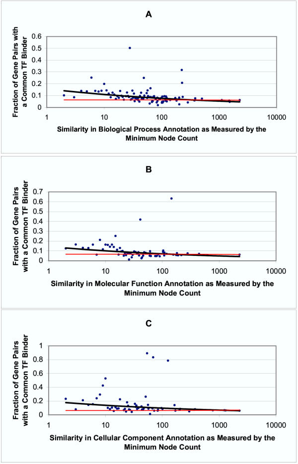
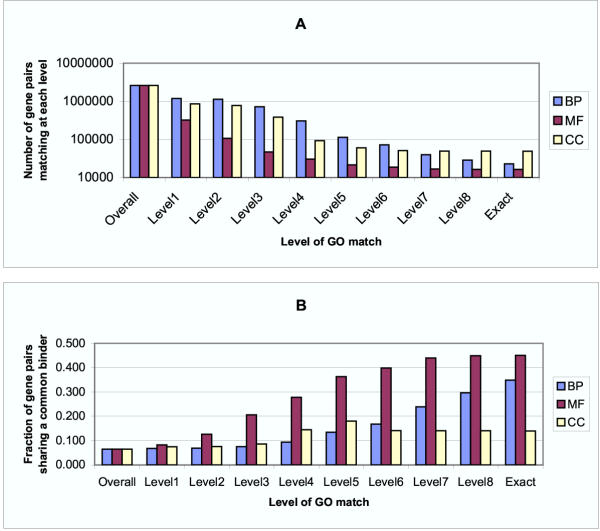
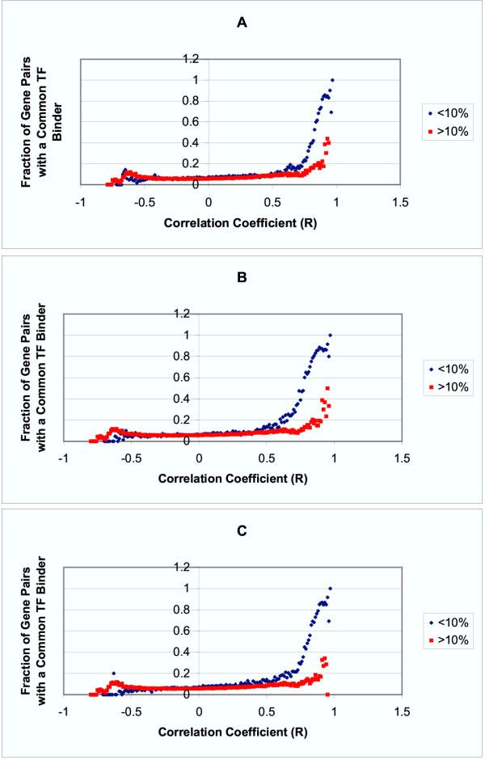
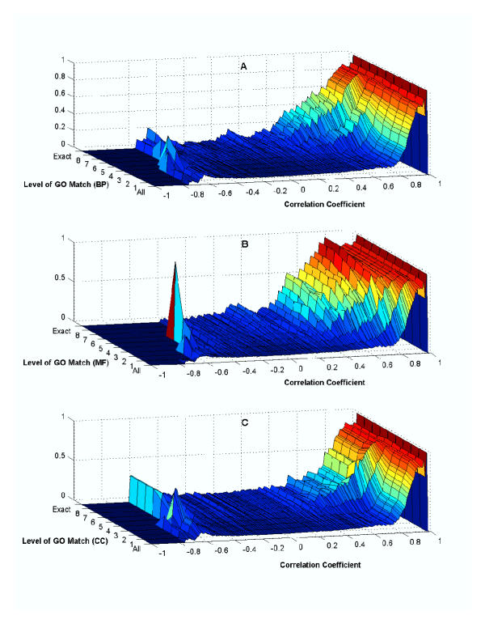

<!-- Custom Styles -->

<!-- Custom JavaScript -->

## Overview

>- An important goal in biology is to understand the gene regulatory networks
   of various organisms.
>- There are now several high-throughput methods for querying the regulatory
>  relationships between genes, e.g.::
>   - ChIP-chip
>   - ChIP-Seq
>- In some cases, however, it is either not possible or not convenient to
>  collect this sort of data (e.g. Trypanosomes.)
>- In principle, genes which are co-regulated should show some similarities in
>  their expression profiles.
>- Is it possible instead to infer gene-regulatory 
>  relationships from transcriptomic data such as Microarray or RNA-Seq?
>- Can functional information be used to improve this
>  inference?

--- .segue .dark

## Background

---

## Transcriptional regulatory networks in Saccharomyces cerevisiae (Lee et al. 2002)

Lee et al. (2002) Figure 1

- Lee et al. describe an early use of chromatin immunoprecipitation
  with microarray technology (ChIP-chip) to query the targets of a set of
  known transcription factors in yeast.
- ChIP-chip limitations (likely improved since the time of writing):
  - Requires regulators (TFs) and target promoters to be known
  - Tagging doesn't always work (non-viable cells/inadequate expression)
  - False positives (~5-6% for high stringency cutoff)
  - False negatives (~33% estimated for same stringency)

---

## Transcriptional regulatory networks in Saccharomyces cerevisiae (Lee et al. 2002)

Lee et al. (2002) Figure 2

- Regulator/promoter relationships are many-to-many:
  - Average of 38 promoters bound by a given regulator
  - More than 1/3 of promoter regions bound by 2+ TFs

--- .segue .dark

## Results

--- .segue .dark

## Co-expression and co-regulation

---

## Co-expression and co-regulation

### Data sources

- Downloaded all public microarray data for *S. cerevisiae* (Stanford
  Microarray Database)
- Excluded genes with no known TFs:
  - 611 arrays
  - 2284 genes
- Downloaded Lee et al's TF binding data:
  - 6270 genes (4532 promoters)
  - 106 TFs

### Measuring co-expression

- Expression data median-centered over all arrays.
- Pearson correlation of expression profiles measured:
    - 2284 x 2284 symmetric matrix

--- .small

## Co-expression and co-regulation

Allocco et al. (2004) Figure 1

- Genes whose expression profiles are highly correlated are likely to share a
  common promoter (high *positive* correlations)
- Requires high correlation, however: at $r=0.84$ there is a 50% of gene
  pairs share a promoter.
- Of the 168,994 pairs with a known common TF, only 3.2% had a
  correlation this high!

---

## Co-expression and co-regulation

Allocco et al. (2004) Figure 2

- "Regulatory closeness", $c(X,Y)$, relaxes restriction on direct TF/gene
  interaction and considers relationships that are one or more steps away on a
  network constructed from TF binding data.
  - $c(X,Y)$ = 1 / # edges between genes

---

## Co-expression and co-regulation

Allocco et al. (2004) Figure 2

- Regulatory closeness measure able to detect smaller effects
- Negative relationships
- Found no increase in correlation detect between a TF and the gene it 
  regulates.

---

## Co-expression and co-regulation

### Effect of adding more datasets

- Initially all 611 microarrays used to calculate correlations
- What would be the effect of using a smaller set of data?
- Allocco et al. next looked at correlations between expression profiles of
  different subsets of microarray data:
    1. Randomly selected experiments
    2. Experiments related to cell-cycle, starvation, and stress.
- In general, adding more experiments increased sensitivity, although after
  ~100 experiments, you don't gain much more.
- Note: One thing they did not do is to test the effect of combining results
  from multiple sub-samples (e.g. using max{cor}.)

---

## Co-expression and co-regulation

### Effect of adding more datasets

Allocco et al. (2004) Figure 3

--- .segue .dark

## Functional similarity vs. co-regulation

---

## Functional similarity vs. co-regulation

### Measuring functional similarity

- In order to determine the relationship between co-regulation and function
  similarity, you must first decide how to measure functional similarity.
- Allocco et al. came up with two Gene Ontology (GO) based measures of
  similarity:

#### 1. Minimum node count

- For each GO term, how many times does it (or a descendant of it) appear in
  the data set?
- Minimum node count for a pair of genes in the value of the smallest (and thus
  rarest) GO term shared by them.

#### 2. GO term levels

- GO term levels = depth in GO hierarchy
- Deeper -> more specific (and, usually, less frequent)

---

## More recent attempts to measure functional similarity between genes

Fröhlich et al. (2007)

---

## Functional similarity vs. co-regulation

### Minimum node count

Allocco et al. (2004) Figure 4

---

## Functional similarity vs. co-regulation

### GO term level

Allocco et al. (2004) Figure 5

---

## Functional similarity vs. co-regulation

### Correlation between co-regulation and two measures

- Both similarity measures shown to correlate to an extent with co-regulation.
- Limitations:
    - Minimum node count has issues with large groups of closely related genes 
      (e.g. ribosomal protein outliers in fig. 4)
    - GO level measure becomes problematic with respect to the variability in
      inclusiveness between the different ontologies.
- Caveat: Interpretation is likely confounded by the
  fact that many annotations are derrived from knowledge of regulatory
  relationships.

---.segue .dark

## Using co-expression and functional similarity to predict co-regulation

---

## Using co-expression and functional similarity to predict co-regulation

- How would picture improve if *both* co-expression and functional similarity
  information is used?
- May be useful for discerning significance of gene pairs with a moderate
  correlation in expression profiles.

---

## Co-regulation vs. Co-expression and Functional Similarity as Defined by Minimum Node Count

Allocco et al. (2004) Figure 6

---

## Co-regulation vs. Co-expression and Functional Similarity as Defined by Level of GO Term Match

Allocco et al. (2004) Figure 7

---.segue .dark

## Conclusions

---

## Conclusions

- Genes with *high* correlations in expression patterns are likely to be
  co-regulated (using common TF-binding as a proxy for co-regulation.)
- Because correlation must be very high, however, caution is advised when
  interpeting the relationship between genes with lower correlation levels in
  the expression profiles.
- More data provides better signal, up to a point.
- Functional annotations may also be useful to improve ability to discern
  co-regulatory relationships.

---

## Questions (of mine...)

1. How different would the picture be if an improved measure of functional
   similarity (e.g. as provided by GOSim), were used?
2. How would results look today if re-run as-is, with improvements made to GO
   over the past ten years?
3. Could a better result be achieved if the correlations of multiple subsamples
   were combined additively instead of treating them independently?
4. Would picture change when using RNA-Seq instead of microarray data?
5. What implications do these results have for systems which do not regulate
   genes at the promoter level?
6. Big picture: What would be required to accurately model expression data
   including co-expression relationships? (would vary between species).

---.smaller

## Atul Butte talk

<a href='http://www.tedmed.com/talks/show?id=7340'>
     
    What if you outsource three double-blind mice? (TEDMED 2012)
</a> 

### Some other interesting papers by Atul:

- Butte AJ, Kohane IS. (2000) Mutual information relevance networks: functional
    genomic clustering using pairwise entropy measurements

- Atul J. Butte, Ling Bao, Ben Y. Reis, Timothy W. Watkins, Isaac S. Kohane,   (2001) Comparing The Similarity of Time-Series Gene Expression Using Signal Processing Metrics.  <em>Journal of Biomedical Informatics</em>  <strong>34</strong>  396-405  <a href="http://dx.doi.org/10.1006/jbin.2002.1037">10.1006/jbin.2002.1037</a>
- Purvesh Khatri, Marina Sirota, Atul J. Butte, Christos A. Ouzounis,   (2012) Ten Years of Pathway Analysis: Current Approaches And Outstanding Challenges.  <em>Plos Computational Biology</em>  <strong>8</strong>  e1002375-NA  <a href="http://dx.doi.org/10.1371/journal.pcbi.1002375">10.1371/journal.pcbi.1002375</a>

---.references

## References

- Dominic J Allocco, Isaac S Kohane, Atul J Butte,   (2004) Unknown.  <em>Bmc Bioinformatics</em>  <strong>5</strong>  18-NA  <a href="http://dx.doi.org/10.1186/1471-2105-5-18">10.1186/1471-2105-5-18</a>
- Holger Fröhlich, Nora Speer, Annemarie Poustka, Tim Beißbarth,   (2007) Gosim – an R-Package For Computation of Information Theoretic go Similarities Between Terms And Gene Products.  <em>Bmc Bioinformatics</em>  <strong>8</strong>  166-NA  <a href="http://dx.doi.org/10.1186/1471-2105-8-166">10.1186/1471-2105-8-166</a>
- T. I. Lee,   (2002) Transcriptional Regulatory Networks in Saccharomyces Cerevisiae.  <em>Science</em>  <strong>298</strong>  799-804  <a href="http://dx.doi.org/10.1126/science.1075090">10.1126/science.1075090</a>

