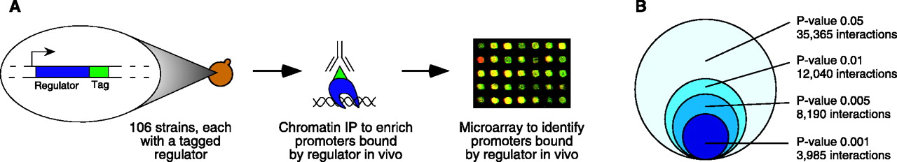
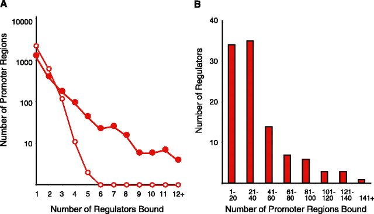
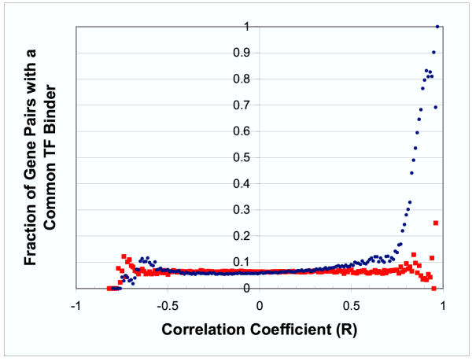
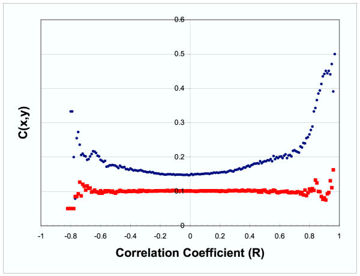
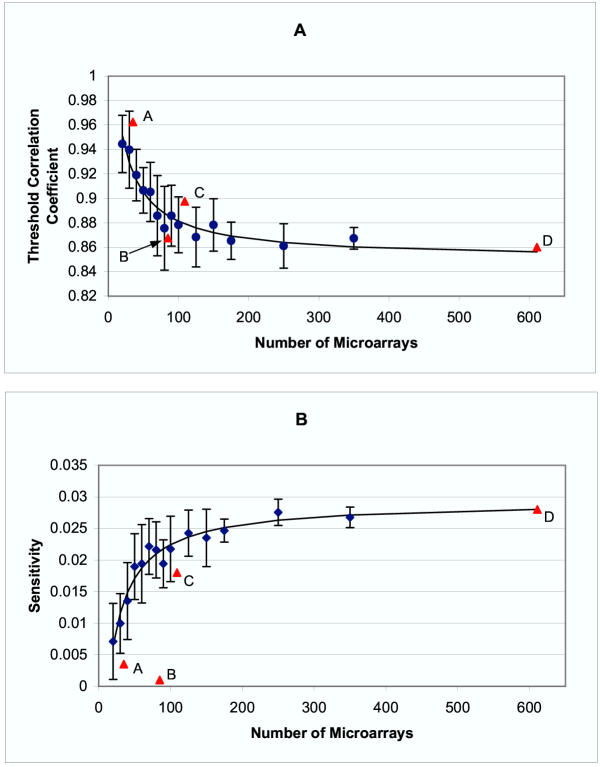

<!-- Custom Styles -->

<!-- Custom JavaScript -->

## Overview

>- An important goal in biology is to understand the gene regulatory networks
   of various organisms.
>- There are now several high-throughput methods for querying the regulatory
>  relationships between genes, e.g.::
>   - ChIP-chip
>   - ChIP-Seq
>- In some cases, however, it is either not possible or not convenient to
>  collect this sort of data (e.g. Trypanosomes.)
>- In principle, genes which are co-regulated should show some similarities in
>  their expression profiles.
>- Is it possible instead to infer gene-regulatory 
>  relationships from transcriptomic data such as Microarray or RNA-Seq?
>- Can functional information be used to improve this
>  inference?

--- .segue .dark

## Background

---

## Transcriptional regulatory networks in Saccharomyces cerevisiae (Lee et al. 2002)

Lee et al. (2002) Figure 1

- Lee et al. describe an early use of chromatin immunoprecipitation
  with microarray technology (ChIP-chip) to query the targets of a set of
  known transcription factors in yeast.
- ChIP-chip limitations (likely improved since the time of writing):
  - Requires regulators (TFs) and target promoters to be known
  - Tagging doesn't always work (non-viable cells/inadequate expression)
  - False positives (~5-6% for high stringency cutoff)
  - False negatives (~33% estimated for same stringency)

---

## Transcriptional regulatory networks in Saccharomyces cerevisiae (Lee et al. 2002)

Lee et al. (2002) Figure 2

- Regulator/promoter relationships are many-to-many:
  - Average of 38 promoters bound by a given regulator
  - More than 1/3 of promoter regions bound by 2+ TFs

--- .segue .dark

## Results

---

## Co-expression and co-regulation

### Data sources

- Downloaded all public microarray data for *S. cerevisiae* (Stanford
  Microarray Database)
- Excluded genes with no known TFs:
  - 611 arrays
  - 2284 genes
- Downloaded Lee et al's TF binding data:
  - 6270 genes (4532 promoters)
  - 106 TFs

### Measuring co-expression

- Expression data median-centered over all arrays.
- Pearson correlation of expression profiles measured:
    - 2284 x 2284 symmetric matrix

--- .smaller

## Co-expression and co-regulation

Allocco et al. (2004) Figure 1

- Genes whose expression profiles are highly correlated are likely to share a
  common promoter (high *positive* correlations)
- Requires high correlation, however: at $r=0.84$ there is a 50% of gene
  pairs share a promoter.
- Of the 168,994 pairs with a known common TF, only 3.2% had a
  correlation this high!

---

## Co-expression and co-regulation

Allocco et al. (2004) Figure 2

- "Regulatory closeness", $c(X,Y)$, relaxes restriction on direct TF/gene
  interaction and considers relationships that are one or more steps away on a
  network constructed from TF binding data.
  - $c(X,Y)$ = 1 / # edges between genes

---

## Co-expression and co-regulation

Allocco et al. (2004) Figure 2

- Regulatory closeness measure able to detect smaller effects
- Negative relationships
- Found no increase in correlation detect between a TF and the gene it 
  regulates.

---

## Co-expression and co-regulation

### Sub-sampling

- Initially all 611 microarrays used to calculate correlations
- What would be the effect of using a smaller set of data?
- Allocco et al. next looked at correlations between expression profiles of
  different subsets of microarray data:
    1. Randomly selected experiments
    2. Experiments related to cell-cycle, starvation, and stress.
- In general, adding more experiments increased sensitivity, although after
  ~100 experiments, you don't gain much more.

---

## Co-expression and co-regulation

Allocco et al. (2004) Figure 3

---.references

## References

- Dominic J Allocco, Isaac S Kohane, Atul J Butte,   (2004) Unknown.  <em>Bmc Bioinformatics</em>  <strong>5</strong>  18-NA  <a href="http://dx.doi.org/10.1186/1471-2105-5-18">10.1186/1471-2105-5-18</a>
- T. I. Lee,   (2002) Transcriptional Regulatory Networks in Saccharomyces Cerevisiae.  <em>Science</em>  <strong>298</strong>  799-804  <a href="http://dx.doi.org/10.1126/science.1075090">10.1126/science.1075090</a>

